<p align="center">
  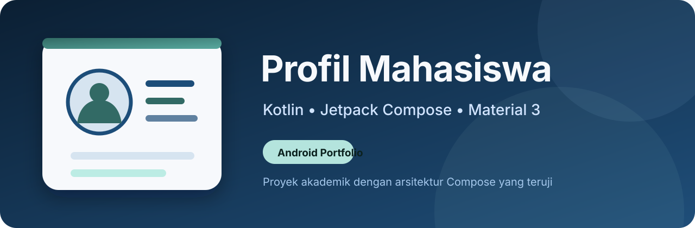
</p>

# Profil Mahasiswa

Aplikasi profil mahasiswa berbasis Kotlin, Jetpack Compose, dan Material 3 yang dikembangkan sebagai tugas Pemrograman Mobile sekaligus portofolio pengembangan Android.


## Gambaran proyek

Profil Mahasiswa adalah aplikasi Android satu layar untuk menyajikan dan menyunting identitas mahasiswa. Proyek ini bermula dari materi praktikum yang diberikan dosen, kemudian direfaktor dan diperluas dengan pemisahan state tersimpan dan draft, validasi murni, workflow edit/simpan/batal, tema Material 3, responsivitas, aksesibilitas dasar, pengujian otomatis, dan branding khusus.

Ruang lingkup sengaja dipertahankan sebagai aplikasi profil satu layar agar tetap selaras dengan materi Week 2 Jetpack Compose. Proyek ini tidak memiliki backend, akun daring, atau penyimpanan permanen.

## Konteks akademik

- Mata kuliah: Pemrograman Mobile
- Materi: Week 2 — Jetpack Compose Fundamentals
- Kegunaan: komponen UAS dan portofolio Android
- Dosen/penyedia materi praktikum: Kukuh Yudhistiro, S.Kom., M.Kom.

## Sorotan

- Arsitektur Compose dengan state hoisting dan aliran data satu arah.
- Mode lihat dan edit dengan draft yang terpisah dari data tersimpan.
- Validasi per field dalam bahasa Indonesia.
- Tema terang dan gelap berbasis Material 3.
- Layout responsif, dukungan keyboard, dan aksesibilitas dasar.
- Enam variasi Compose Preview.
- 18 unit test dan 6 instrumentation test lulus.
- Android Lint berhasil tanpa error.

## Kepatuhan tugas Week 2

| Persyaratan | Implementasi | Bukti/status |
|---|---|---|
| `Column` | Susunan konten vertikal, header, dan card | Terpenuhi |
| `Row` | Informasi akademik, field, dan actions | Terpenuhi |
| `Box` | Container layar dan avatar bertumpuk | Terpenuhi |
| Avatar | `ProfileAvatar` dengan ikon profil | Terpenuhi |
| Nama | Muhammad Farhan | Terpenuhi |
| NIM | 23083000060 | Terpenuhi |
| Program studi | S1 Sistem Informasi | Terpenuhi |
| Semester | Semester 6 | Terpenuhi |
| Card kontak | `ContactInformationCard` | Terpenuhi |
| Email dan telepon | Field kontak dengan data aman | Terpenuhi |
| `padding` | Screen, card, field, dan actions | Terpenuhi |
| `background` | Avatar, badge, dan field container | Terpenuhi |
| `border` | Avatar dan status badge | Terpenuhi |
| `fillMaxWidth` | Card, field, dan tombol | Terpenuhi |
| Tombol mengubah state | Edit, Simpan, dan Batal | Terpenuhi |
| Recomposition | Peralihan mode lihat/edit | Terpenuhi |
| Preview | Enam fungsi `@Preview` | Terpenuhi |
| Preview mode lihat | Terang dan gelap | Terpenuhi |
| Preview mode edit | Draft valid dan error validasi | Terpenuhi |

## Fitur utama

- Menampilkan nama, NIM, program studi, semester, email contoh, dan telepon tersamarkan.
- Nama, program studi, email, dan telepon dapat disunting.
- NIM dan semester tetap read-only.
- Edit menyalin data tersimpan menjadi draft.
- Batal membuang perubahan draft.
- Simpan melakukan normalisasi dan validasi sebelum memperbarui profil.
- Snackbar mengonfirmasi pembaruan yang berhasil.
- State bertahan saat Activity direkreasi.
- Icon launcher adaptive, round, fallback, dan monochrome.

## Workflow aplikasi

1. Aplikasi dibuka dalam mode lihat.
2. **Edit Profil** membuat draft dari profil tersimpan.
3. Pengguna menyunting field yang diizinkan.
4. **Simpan** memvalidasi draft; data valid disimpan dan Snackbar ditampilkan.
5. Data invalid mempertahankan mode edit dan menampilkan supporting error.
6. **Batal** membuang draft dan kembali ke profil tersimpan.

## Teknologi

| Komponen | Versi/konfigurasi |
|---|---|
| Kotlin | 2.0.21 |
| Android Gradle Plugin | 8.7.3 |
| Gradle Wrapper | 8.9 |
| Compose BOM | 2024.12.01 |
| Material | Material 3 |
| compileSdk / targetSdk | 35 / 35 |
| minSdk | 24 |
| Java/Kotlin target | 11 |

## Arsitektur

Proyek menggunakan **state-hoisted Compose architecture** dengan aliran data satu arah yang proporsional untuk aplikasi satu layar.

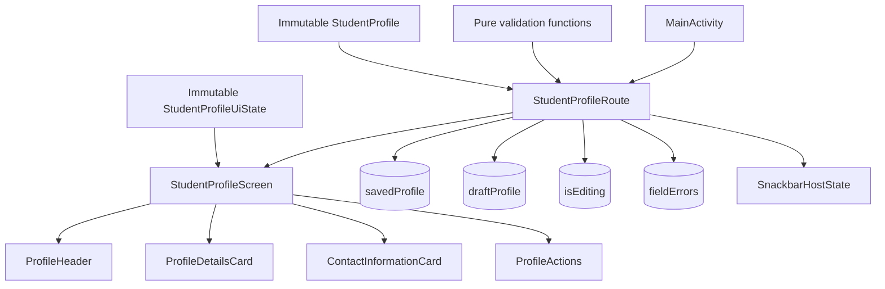

`StudentProfileRoute` memiliki state utama dan meneruskan immutable `StudentProfileUiState` serta callbacks ke `StudentProfileScreen`. Komponen layar tidak menyimpan business state utama.

## State dan aliran data

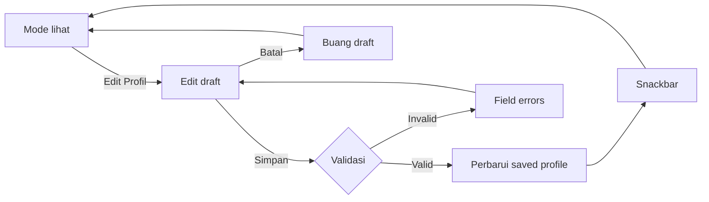

State profil, draft, mode edit, dan error menggunakan `rememberSaveable`. `StudentProfile` dan error field mempunyai custom `listSaver`.

> Data profil bertahan terhadap rekreasi Activity melalui `rememberSaveable`, tetapi tidak disimpan secara permanen setelah proses aplikasi dihentikan.

## Validasi

| Field | Aturan |
|---|---|
| Nama | Wajib; maksimum 60 karakter |
| Program studi | Wajib; maksimum 80 karakter |
| Email | Wajib; validasi format praktis |
| Telepon | Wajib; karakter angka, `x`, `+`, kurung, spasi, dan tanda hubung; 8–15 digit |
| Normalisasi | Spasi di awal dan akhir nama, program studi, email, dan telepon dihapus |

Pola email merupakan validasi praktis aplikasi, bukan sertifikasi RFC lengkap. Format telepon portofolio `+62 8xx-xxxx-xxxx` sengaja diterima. Email `example.com` dan telepon tersamarkan digunakan untuk menjaga privasi.

## Material 3, responsivitas, dan aksesibilitas dasar

- Custom light dan dark color scheme mengikuti tema sistem.
- Dynamic color dinonaktifkan secara default agar identitas visual konsisten.
- Lebar konten dibatasi hingga 600 dp dan dapat di-scroll vertikal.
- Tombol edit memiliki tinggi minimum 48 dp; actions ditumpuk pada layar sempit.
- Read-only contact values dapat membungkus hingga dua baris.
- Label text field persisten dan error dilengkapi supporting text.
- Ikon informatif memiliki deskripsi bahasa Indonesia; ikon dekoratif tidak dibacakan.
- Fokus keyboard bergerak logis dan `imePadding` menjaga actions tetap dapat dijangkau.

Proyek menyediakan fondasi aksesibilitas, tetapi tidak mengklaim kesesuaian WCAG yang terukur.

## Tangkapan layar

| Profil utama | Mode edit |
|---|---|
| 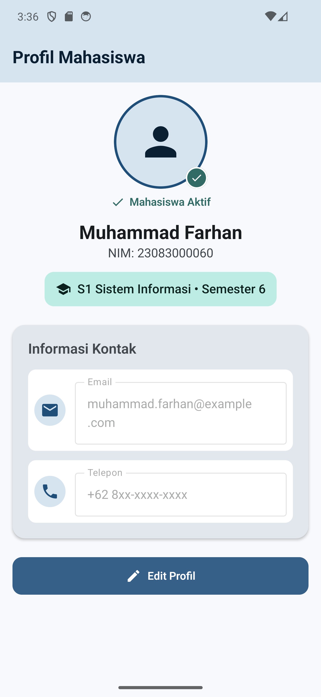 | 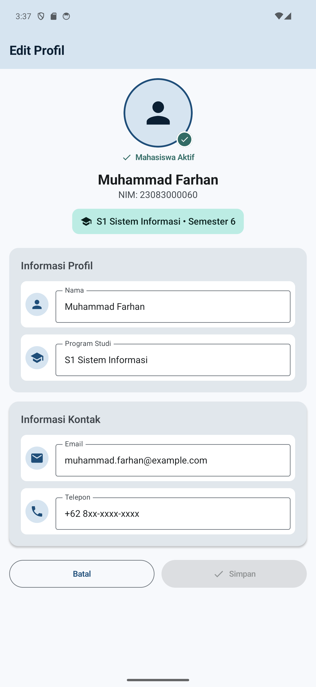 |

| Validasi form | Profil berhasil disimpan |
|---|---|
| 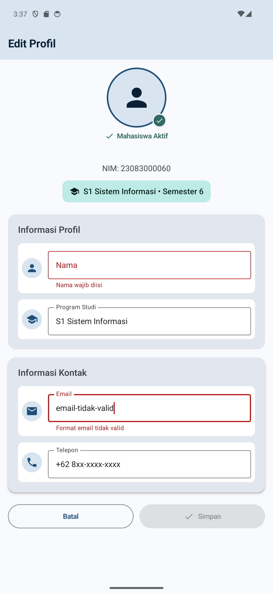 | 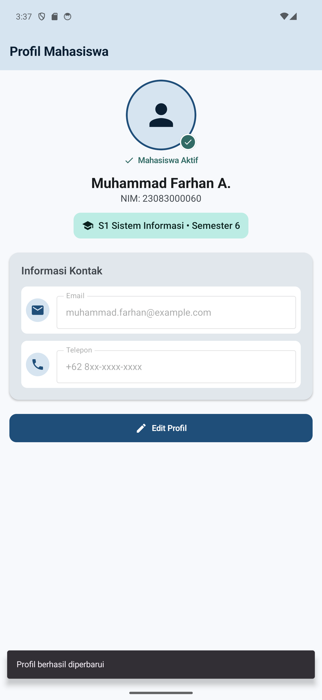 |

| Mode gelap | Keyboard dan form |
|---|---|
| 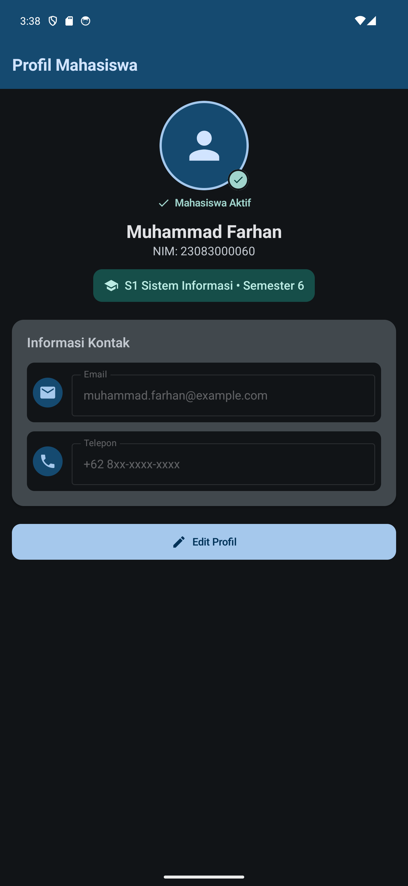 | 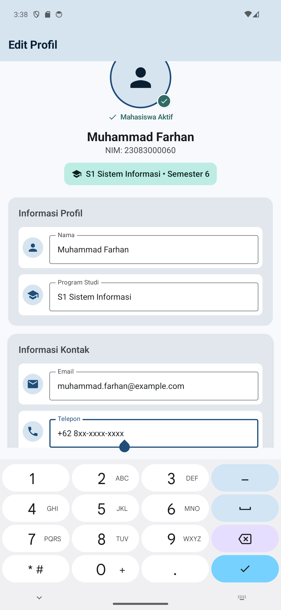 |

| Layar kecil | Font 1,5× |
|---|---|
| 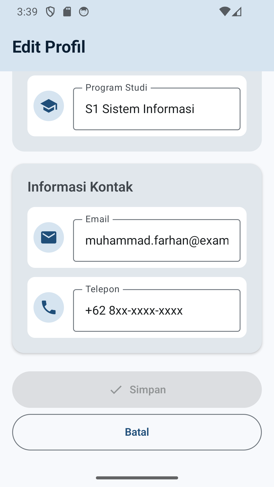 | 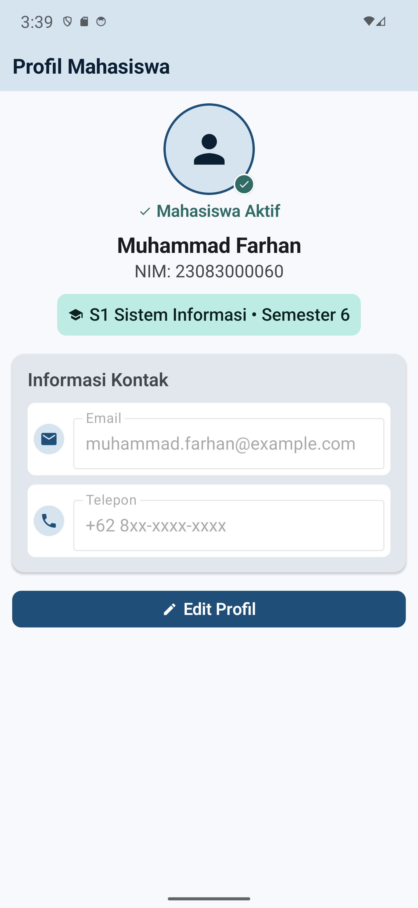 |

## Compose Preview

`StudentProfilePreviews.kt` menyediakan:

- `ProfileLightPreview`
- `ProfileDarkPreview`
- `ProfileEditPreview`
- `ProfileErrorPreview`
- `ProfileSmallScreenPreview` — 360 × 640 dp
- `ProfileLargeTextPreview` — font scale 1,5×

Preview dapat dibuka melalui tab **Split** atau **Design** di Android Studio. Gambar panel Compose Preview belum disertakan sampai tangkapan layar asli dari Android Studio tersedia.

## Struktur proyek

```text
app/src/
├── main/
│   ├── java/com/muhammadfarhan/profilmahasiswa/
│   │   ├── MainActivity.kt
│   │   ├── model/StudentProfile.kt
│   │   ├── screens/profile/
│   │   │   ├── StudentProfileRoute.kt
│   │   │   ├── StudentProfileScreen.kt
│   │   │   ├── StudentProfileComponents.kt
│   │   │   ├── StudentProfileUiState.kt
│   │   │   ├── StudentProfileValidation.kt
│   │   │   └── StudentProfilePreviews.kt
│   │   └── ui/theme/
│   └── res/
├── test/          # JVM validation tests
└── androidTest/   # Compose instrumentation tests
```

## Kebutuhan lingkungan

- Android Studio dengan Android SDK 35
- JDK 17 atau Android Studio JBR yang kompatibel
- Emulator/perangkat Android API 24 atau lebih baru
- Git

## Instalasi dan menjalankan

```powershell
git clone <URL_REPOSITORI>
cd profil-mahasiswa-jetpack-compose
.\gradlew.bat assembleDebug
```

Buka folder proyek di Android Studio, tunggu Gradle Sync, pilih emulator/perangkat, lalu jalankan konfigurasi `app`.

## Pengujian otomatis

Windows PowerShell:

```powershell
.\gradlew.bat testDebugUnitTest --no-daemon --console=plain
.\gradlew.bat assembleDebugAndroidTest --no-daemon --console=plain
.\gradlew.bat connectedDebugAndroidTest --no-daemon --console=plain
.\gradlew.bat lint --no-daemon --console=plain
.\gradlew.bat assembleDebug --no-daemon --console=plain
```

Unix/macOS:

```bash
./gradlew testDebugUnitTest --no-daemon --console=plain
./gradlew assembleDebugAndroidTest --no-daemon --console=plain
./gradlew lint --no-daemon --console=plain
./gradlew assembleDebug --no-daemon --console=plain
```

`connectedDebugAndroidTest` memerlukan emulator atau perangkat Android yang aktif.

## Hasil terverifikasi

| Quality check | Hasil |
|---|---|
| Unit test JVM | 18/18 lulus |
| Instrumentation test | 6/6 lulus |
| Debug build | Berhasil |
| AndroidTest APK build | Berhasil |
| Android Lint | Berhasil, 0 error |
| Visual QA | Lulus pada Pixel 6 Pro AVD, Android 14 API 34 |

GitHub Actions menjalankan unit test, debug build, kompilasi AndroidTest APK, dan lint. Instrumentation test runtime telah diverifikasi secara lokal pada emulator API 34; workflow awal tidak menjalankan emulator.

Tidak ada persentase code coverage yang diklaim karena pengukuran coverage belum dikonfigurasi.

## Keputusan teknis

- **State hoisting** menjaga screen mudah dipreview dan diuji.
- **`rememberSaveable`** cukup untuk target Activity recreation dalam cakupan tugas.
- **Saved dan draft profile terpisah** agar Cancel tidak merusak data tersimpan.
- **Validasi murni** memudahkan 18 pengujian JVM tanpa Android framework.
- **Dynamic color nonaktif** menjaga palette biru/hijau konsisten.
- **Tanpa ViewModel/database/backend** untuk menghindari arsitektur berlebihan pada aplikasi satu layar.
- **NIM dan semester read-only** karena keduanya merupakan identitas akademik tetap.
- **Kontak placeholder** mencegah data pribadi masuk ke portofolio publik.
- **Upgrade dependency luas ditunda** setelah toolchain stabil; advisori dicatat tanpa mengubah scope.

## Tantangan dan solusi

| Tantangan | Solusi |
|---|---|
| Draft edit tidak boleh langsung mengubah profil | Memisahkan `savedProfile` dan `draftProfile` |
| State perlu bertahan saat Activity direkreasi | `rememberSaveable` dan custom saver |
| Error harus jelas dan mudah diuji | Pure validation + enum error + string resource |
| Form harus dapat dipakai dengan keyboard | FocusRequester, IME actions, scrolling, dan `imePadding` |
| Nilai email terpotong pada layar sempit | Read-only field diizinkan membungkus dua baris |
| Test read-only menemukan dua teks prodi | Matcher semantik presisi dengan `hasSetTextAction` |

## Batasan

- Tidak ada persistence permanen.
- Tidak ada backend atau sinkronisasi akun.
- Tidak ada upload foto.
- Data kontak berupa contoh/tersamarkan.
- Scope berfokus pada satu screen profil.
- Belum dipublikasikan ke Play Store.
- Tidak ada pengukuran kesesuaian WCAG.
- Advisori pembaruan dependency masih ditunda secara sengaja.

## Privasi

Nama dan NIM ditampilkan sebagai identitas akademik. Email menggunakan domain `example.com` dan telepon disamarkan. Aplikasi tidak menyimpan alamat rumah, credential, API key, atau nomor telepon pribadi. Repositori mengecualikan `local.properties`, build output, keystore, cache, dan path mesin lokal.

## Pengembang

- Nama: Muhammad Farhan
- NIM: 23083000060
- Program Studi: S1 Sistem Informasi
- Semester: 6

## Atribusi akademik

Proyek ini dikembangkan dan direfaktor dari materi praktikum Pemrograman Mobile yang disediakan oleh Kukuh Yudhistiro, S.Kom., M.Kom., kemudian diperluas oleh Muhammad Farhan untuk kebutuhan UAS dan portofolio.

Detail atribusi dan batas cakupan lisensi tersedia di [NOTICE.md](NOTICE.md).

## Lisensi

Modifikasi dan tambahan orisinal Muhammad Farhan dilisensikan dengan MIT License; lihat [LICENSE](LICENSE). Lisensi tersebut tidak menggantikan kepemilikan materi awal dosen maupun lisensi komponen pihak ketiga. Redistribusi publik proyek menunggu konfirmasi izin atas materi starter.

## Referensi

- [Jetpack Compose](https://developer.android.com/develop/ui/compose)
- [Compose layouts](https://developer.android.com/develop/ui/compose/layouts)
- [State in Compose](https://developer.android.com/develop/ui/compose/state)
- [Material 3 in Compose](https://developer.android.com/develop/ui/compose/designsystems/material3)
- [Testing Compose layouts](https://developer.android.com/develop/ui/compose/testing)
- [Accessibility in Compose](https://developer.android.com/develop/ui/compose/accessibility)
