<p align="center">
  
</p>

# Profil Mahasiswa

[](https://kotlinlang.org/)
[](https://developer.android.com/jetpack/compose)
[](https://www.android.com/)
[](LICENSE)

Aplikasi Android modern berbasis **Jetpack Compose** dan **Material 3** untuk manajemen data profil mahasiswa, dokumentasi nilai akademik demonstrasi, dan kustomisasi identitas visual.

Proyek ini dikembangkan sebagai komponen portofolio profesional dan tugas UAS Pemrograman Mobile yang menekankan pada kualitas arsitektur, pengalaman pengguna (UX), responsivitas, dan pengujian otomatis.

---

## Identitas Pengembang
*   **Nama:** Muhammad Farhan
*   **NIM:** 23083000060
*   **Mata Kuliah:** Pemrograman Mobile
*   **Dosen:** Kukuh Yudhistiro, S.Kom., M.Kom.

---

## Teknologi Utama
*   **Kotlin & Jetpack Compose:** UI deklaratif murni dengan *state hoisting*.
*   **Material 3:** Sistem desain modern dengan dukungan *Dark Mode* dan komponen adaptif.
*   **Android Photo Picker:** Pemilihan foto profil aman (privasi maksimal, tanpa izin storage).
*   **Coil:** Library pemuatan gambar yang dioptimalkan untuk performa Compose.
*   **Compose Navigation:** Navigasi tersentralisasi dan *type-safe* antar destinasi.

---

## Fitur Utama

### 1. Manajemen Profil Mahasiswa
*   **Daftar Mahasiswa:** Direktori interaktif dengan status identitas profil utama.
*   **Tambah Mahasiswa:** Form input dengan validasi *real-time* dan pencegahan duplikasi NIM.
*   **Edit Profil:** Workflow sunting data (Nama, Prodi, Email, Telepon) dengan dukungan draf dan pemulihan data (Cancel).

### 2. Kustomisasi Foto Profil
*   Integrasi **Photo Picker** sistem Android.
*   Dukungan draf foto: perubahan hanya permanen setelah dikonfirmasi "Simpan".
*   *Fallback* avatar otomatis jika foto tidak tersedia.

### 3. Data Nilai Mahasiswa
*   Ringkasan performa akademik: Jumlah MK, rata-rata nilai, dan nilai tertinggi.
*   Visualisasi daftar nilai dengan badge indikator warna alfabetis (A, B, C, dst).

---

## Alur Aplikasi (Flow)

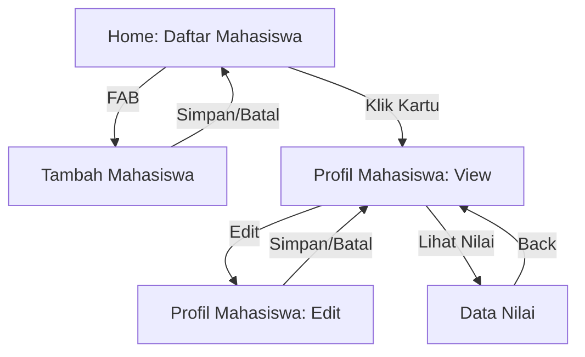

---

## Dokumentasi Visual

### A. Beranda & Tema
| Beranda (Terang) | Beranda (Gelap) |
|:---:|:---:|
| 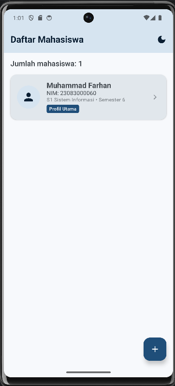 | 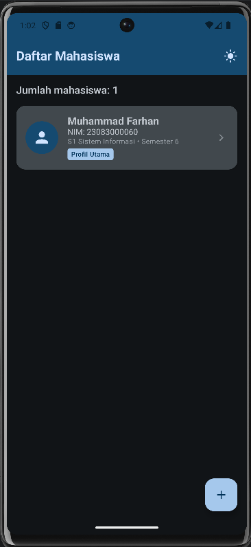 |
| *01. Daftar mahasiswa interaktif.* | *02. Implementasi Dark Mode.* |

### B. Penambahan Mahasiswa
| Form Kosong | Validasi Error | Form Valid |
|:---:|:---:|:---:|
| 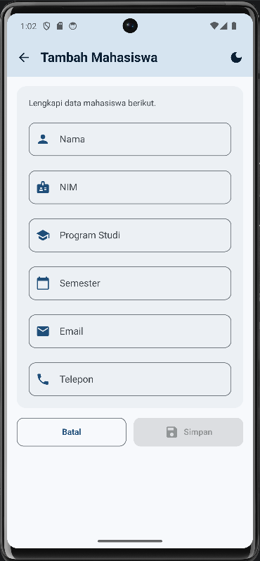 | 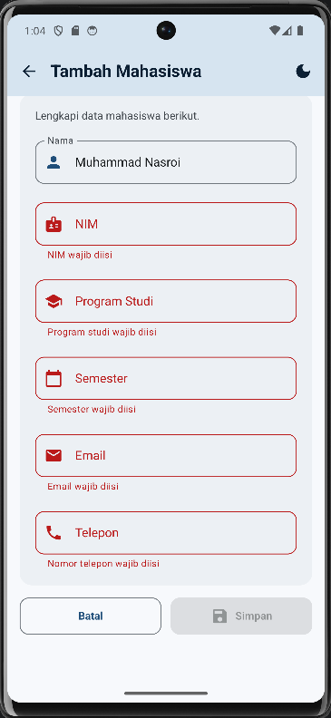 | 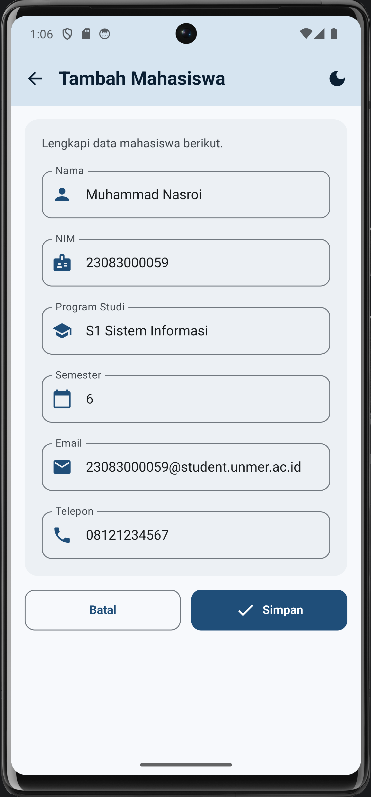 |
| *03. Input data baru.* | *04. Pesan error bahasa Indonesia.* | *05. Tombol aktif saat valid.* |

### C. Profil & Foto
| Tampilan Profil | Mode Edit | Foto Profil Terpilih |
|:---:|:---:|:---:|
| 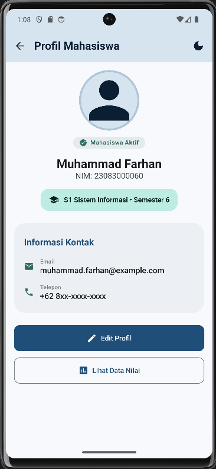 | 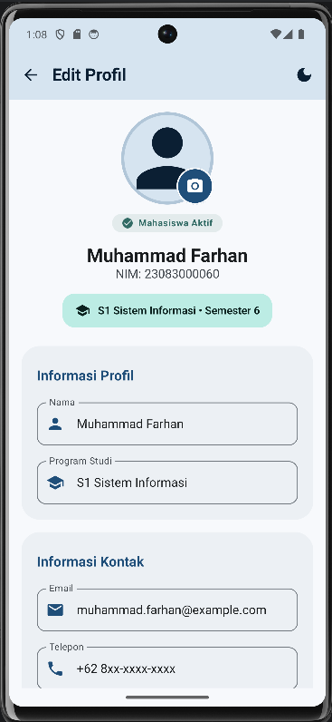 | 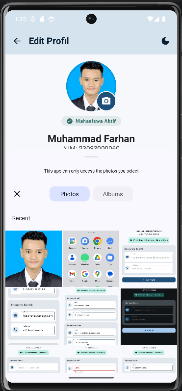 |
| *06. Identitas lengkap.* | *07. Input terfokus (IME).* | *10. Hasil Photo Picker.* |

### D. Data Nilai
| Nilai Terisi | Nilai Kosong |
|:---:|:---:|
| 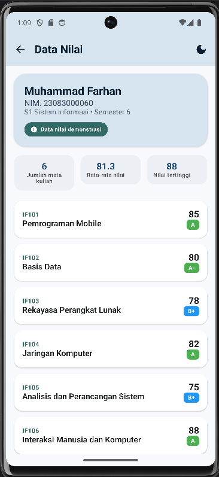 | 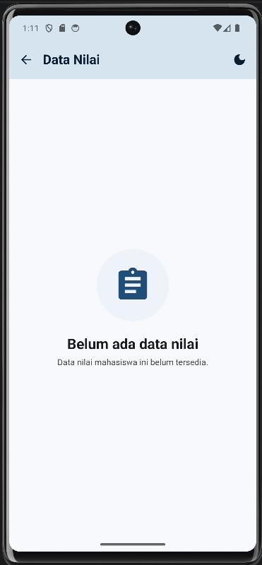 |
| *08. Statistik & Daftar MK.* | *09. Tampilan informatif.* |

---

## Arsitektur & Kualitas Kode

Aplikasi ini menggunakan pola **State Hoisting** dengan *single source of truth* di tingkat root aplikasi.

*   **MainActivity:** *Entry point* yang memicu `ProfilMahasiswaApp`.
*   **StudentAppState:** *Single source of truth* (immutable) untuk data global.
*   **Stateless Screens:** Komponen UI murni tanpa logika bisnis internal.
*   **Savers:** Implementasi `Saver` khusus untuk memastikan draf input bertahan saat terjadi perubahan konfigurasi.
*   **Aksesibilitas:** Touch target >48dp, deskripsi TalkBack, dan dukungan skala font 1.5x (diverifikasi saat QA).
*   **Responsivitas:** Layout teruji pada layar 360dp, landscape, dan tablet.

---

## Kualitas & Pengujian

Aplikasi telah melewati rangkaian verifikasi otomatis dengan hasil sebagai berikut:

*   **JVM Unit Tests:** 70 passed
*   **Instrumentation Tests:** 41 passed
*   **Android Lint:** 0 errors / 0 warnings

### Perintah Verifikasi (PowerShell):
```powershell
.\gradlew.bat testDebugUnitTest
.\gradlew.bat connectedDebugAndroidTest
.\gradlew.bat lintDebug
.\gradlew.bat assembleDebug
```

---

## Cara Menjalankan Proyek

1.  **Persyaratan:** Android Studio Ladybug atau lebih baru, JDK 17+.
2.  **Clone:** `git clone <repo-url>`
3.  **Sync:** Buka di Android Studio dan lakukan *Gradle Sync*.
4.  **Run:** Pilih emulator (disarankan Pixel 6) dan klik *Run 'app'*.

---

## Struktur Proyek
```text
app/src/main/java/com/muhammadfarhan/profilmahasiswa/
├── app/          # State global, Saver, dan App Root
├── model/        # Data Class (Profile, Grade)
├── navigation/   # AppRoutes dan AppNavigation
├── screens/      # Implementasi Screen (Home, Add, Profile, Grades)
└── ui/           # Theme Material 3 dan Komponen Reusable

docs/
└── screenshots/  # Aset dokumentasi
```

---

## Batasan & Disklaimer Akademik
*   **Data Runtime:** Perubahan hanya disimpan di RAM selama aplikasi berjalan (tidak ada database permanen).
*   **Privasi Gambar:** Akses foto profil menggunakan URI sementara dari Photo Picker.
*   **Data Nilai:** Seluruh data nilai bersifat **demonstrasi** untuk portofolio UI dan **bukan transkrip resmi**.
*   **Tujuan:** Proyek dikembangkan murni untuk portofolio akademik UAS.

---

## Lisensi
Distribusi asli Muhammad Farhan dilisensikan di bawah [MIT License](LICENSE).
